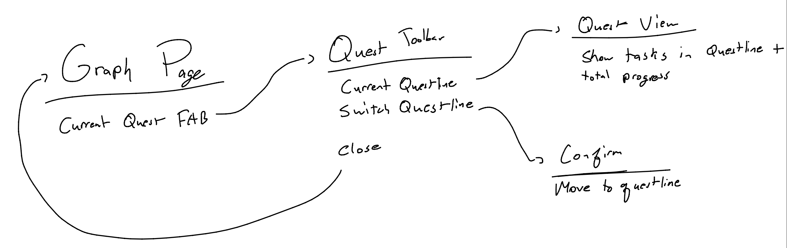

## Quest System

For our project, we need a way to prioritize available tasks to work on. A Mikado Graph can get quite large, and finding tasks without dependencies can be annoying when working with these large graphs. We do have color coding, but it can get overwhelming on what to work on and there is not any priortiy system in place. 

To achieve this, we want to "gameify" the system - have an algorithm that chooses a line of tasks to work on that will help complete the goal. Using this system, we can guide the user with their tasks and help keep them on track while also reducing "choice exhaustion". 

