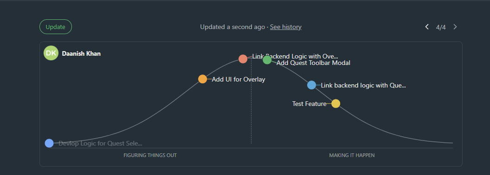
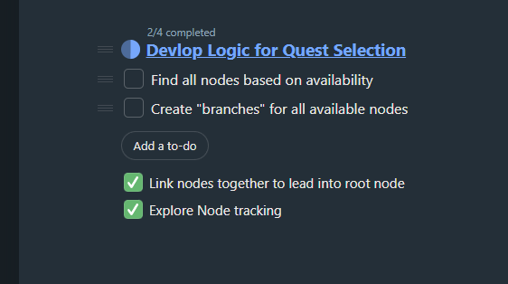

# Weekly Update

- Backend development going smoothly
- Largest amount of work needed in this aspect, so it is taking quite a long time
	- Especially with experimenting with new approaches
	- Other capstone members are busy with working on other features, so it is just me and Daniel working on this
	- Hoped to be a little faster, but we will ramp up development

- Nodes have been linked together
- Node tracking has been explored (using DFS to find nodes)

## Meeting Minutes

- Short meeting this week
	- Everyone understands their roles and what they ahve to do, no questions at this time
	- Since this is with the capstone project, it is a little bit hard to juggle both since a new feature this late in the game is hard
		- Will have to prioritize this feature while others work on polish
- Will meet with client next week

